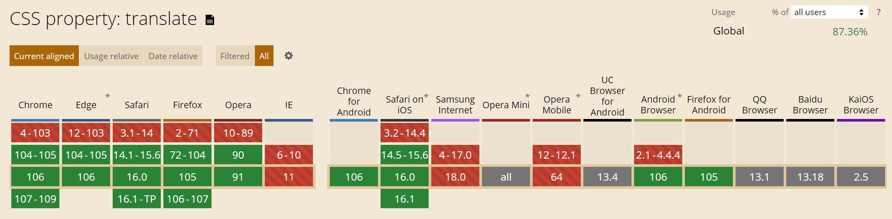

`transform` 속성에 포함된 `rotate`, `scale`, `translate` 함수들이 독립적인 CSS 속성으로 분리된다고 합니다.<br>
각 함수들이 분리됨에 따라 `transition` 을 사용한 애니메이션을 구현하기 편리해질 것으로 기대가 되네요.

```scss
// before
div {
  transform: scale(1.2) rotate(45deg);
}

// after
div {
  scale: 1.2;
  rotate: 45deg;
}
```

적용 전에 아래 지원 브라우저를 참고하시기 바랍니다.

