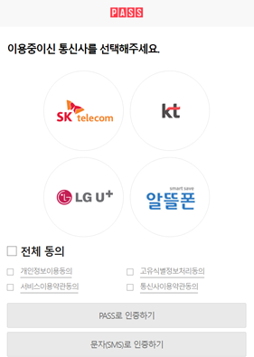

이번에 맡게된 프로젝트에서 중복신청 체크를 위해 본인확인서비스를 적용하게 되었습니다.

그 과정과 시행착오들을 간략하게 정리해보았습니다.

철저히 프론트엔드에 관한 내용만 정리했으니 참고 부탁드립니다.

※ 한국모바일인증과 본인확인서비스 계약을 하게되면 가이드문서를 제공받을 수 있습니다.

### 본인인증 팝업 띄우기



이렇게 생긴 팝업을 띄우기 위해선 `form` 을 사용하여 `post` 로 데이터를 전송해야 합니다.

```html
<script setup>
import { reactive } from 'vue'
import { useSomeStore } from '@/stores/some'

const someStore = useSomeStore();

const state = reactive({
  KMCIS_window: null,
  kmcis: {
    cert: '',
    url: '',
    add: '',
  },
  callbackUrl: '/callback'
});

async function setting() {
  state.KMCIS_window = window.open(
    state.callbackUrl,
    'KMCISWindow',
    'width=397, height=693, resizable=0, scrollbars=no, status=0, titlebar=0, toolbar=0, left=435, top=250',
  );

  if (state.KMCIS_window == null) {
    alert(
      `※ 윈도우 XP SP2 또는 인터넷 익스플로러 7 사용자일 경우에는\n
      화면 상단에 있는 팝업 차단 알림줄을 클릭하여 팝업을 허용해 주시기 바랍니다.\n\n
      ※ MSN,야후,구글 팝업 차단 툴바가 설치된 경우 팝업허용을 해주시기 바랍니다.`
    );
  }

  const code = await someStore.getCertificateData(); // 본인인증 암호문 (백엔드에서 작업)

  state.kmcis.cert = code;
  state.kmcis.url = `${window.location.protocol}//${window.location.host}${state.callbackUrl}`; // 서비스 결과 수신 URL
  state.kmcis.add = 'Y'; // popup = Y, iframe = N

  document.reqKMCISForm.target = 'KMCISWindow';

  window.call = async function(data) {
    console.log('success', data)
  };
}

async function authorization() {
  await setting();
  setTimeout(() => {
    document.reqKMCISForm.submit();
  }, 100);
}
</script>

<template>
  <div class="authorization-area">
    <form name="reqKMCISForm" id="reqKMCISForm" method="post" action="https://www.kmcert.com/kmcis/web/kmcisReq.jsp">
      <input type="hidden" name="tr_cert" v-model="state.kmcis.cert" />
      <input type="hidden" name="tr_url" v-model="state.kmcis.url" />
      <input type="hidden" name="tr_add" v-model="state.kmcis.add" />
    </form>
    <button type="button" @click="authorization">인증하기</button>
  </div>
</template>
```

### 결과 페이지

팝업 띄우기에 성공했다면 결과페이지를 만들어 줍니다.

```html
<script setup>
import { onMounted } from 'vue'
import { useRoute } from 'vue-router';
import { useSomeStore } from '@/stores/some'
import qs from 'qs';

const someStore = useSomeStore();
const route = useRoute();
const query = qs.parse(route.query);

onMounted(async () => {
  if (query.rec_cert) {
    const result = await someStore.getCetificateResult({
      certNum: query.certNum,
      recCert: query.rec_cert
    })

    opener.call(true);
    window.close();
  }
});
</script>
  
<template>
  <div class="page-callback">
    <p>Callback</p>
  </div>
</template>
```

만약 결과페이지에서 405 error가 난다던가 query가 빈값으로 내려온다면 결과 메소드가 `post`는 아닌지 의심해 봐야합니다.
만약 `post`로 받고 있다면 업체 고객센터에 전화해서 `get`방식으로 바꿔달라고 요청합니다.
개발자가 바꿀 수 없어요,, 저는 이것때문에 반나절동안 고생했습니다.